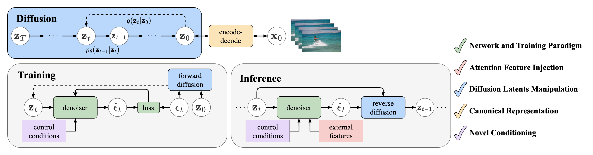

<h1 align="center">Diffusion Model-Based Video Editing: A Survey</h1>

<p align="center">
<a href="https://github.com/wenhao728/awesome-diffusion-v2v"></a>
<a href="https://arxiv.org/abs/2407.07111"></a>
<a href="https://opensource.org/license/mit/"></a>
</a>
<!--  -->
<!-- </a> -->
</p>

<p align="center">
<a href="https://github.com/wenhao728">Wenhao Sun</a>,
<a href=https://github.com/rongchengtu1>Rong-Cheng Tu</a>,
<a>Jingyi Liao</a>,
<a>Dacheng Tao</a>
<br>
<em>Nanyang Technological University</em>
</p>

<!-- <p align="center">

</p> -->


https://github.com/wenhao728/awesome-diffusion-v2v/assets/65353366/fd42e40f-265d-4d72-8dc1-bf74d00fe87b


## 📌 Table of Contents
- [Introduction](#introduction)
- [Network and Training Paradigm](#network-and-training-paradigm)
    - [Temporal Adaption](#temporal-adaption)
    - [Structure Conditioning](#structure-conditioning)
    - [Training Modification](#training-modification)
- [Attention Feature Injection](#attention-feature-injection)
    - [Inversion-Based Feature Injection](#inversion-based-feature-injection)
    - [Motion-Based Feature Injection](#motion-based-feature-injection)
- [Diffusion Latents Manipulation](#diffusion-latents-manipulation)
    - [Latent Initialization](#latent-initialization)
    - [Latent Transition](#latent-transition)
- [Canonical Representation](#canonical-representation)
- [Novel Conditioning](#novel-conditioning)
    - [Point-Based Editing](#point-based-editing)
    - [Pose-Guided Human Action Editing](#pose-guided-human-action-edit)

## Introduction
<p align="center">

<br><em>Overview of diffusion-based video editing model components.</em>
</p>

The diffusion process defines a Markov chain that progressively adds random noise to data and learns to reverse this process to generate desired data samples from noise. Deep neural networks facilitate the transitions between latent states.
- In [Network and Training Paradigm](#network-and-training-paradigm), we explore neural network modifications to adapt diffusion models for video editing tasks.
- [Attention Feature Injection](#attention-feature-injection) introduces a training-free inference-time technique.
- [Diffusion Latents Manipulation](#diffusion-latents-manipulation) methods treat the neural network as a black box, focusing on the diffusion process itself.
- We then list [Canonical Representation](#canonical-representation) methods for efficient video representation.
- Finally, [Novel Conditioning](#novel-conditioning) methods cover innovative conditioning techniques for video editing tasks.

## Network and Training Paradigm
### Temporal Adaption
| Method | Paper | Project | Publication | Year | 
|:------:|:-----:|:----:|:-----------:|:----:|
| Tune-A-Video: One-Shot Tuning of Image Diffusion Models for Text-to-Video Generation | [arXiv](https://arxiv.org/abs/2212.11565) | [Website](https://tuneavideo.github.io/), [GitHub](https://github.com/showlab/Tune-A-Video) | ICCV | Dec 2022 |
| Towards Consistent Video Editing with Text-to-Image Diffusion Models | [arXiv](https://arxiv.org/abs/2305.17431) | | NeurIPS | May 2023 |
| SimDA: Simple Diffusion Adapter for Efficient Video Generation | [arXiv](https://arxiv.org/abs/2308.09710) | [Website](https://chenhsing.github.io/SimDA/), [GitHub](https://github.com/ChenHsing/SimDA) | Preprint | Aug 2023 |
| VidToMe: Video Token Merging for Zero-Shot Video Editing | [arXiv](https://arxiv.org/abs/2312.10656) | [Website](https://vidtome-diffusion.github.io/), [GitHub](https://github.com/lixirui142/VidToMe) | Preprint | Dec 2023 |
| Fairy: Fast Parallelized Instruction-Guided Video-to-Video Synthesis | [arXiv](https://arxiv.org/abs/2312.13834) | [Website](https://fairy-video2video.github.io/) | Preprint | Dec 2023 |


<p align="right">(<a href="#top">back to top</a>)</p>

### Structure Conditioning
| Method | Paper | Project | Publication | Year | 
|:------:|:-----:|:----:|:-----------:|:----:|
| Structure and Content-Guided Video Synthesis with Diffusion Models | [arXiv](https://arxiv.org/abs/2302.03011) | [Website](https://research.runwayml.com/gen1) | Preprint | Feb 2023 |
| VideoComposer: Compositional Video Synthesis with Motion Controllability | [arXiv](https://arxiv.org/abs/2306.02018) | [Website](https://videocomposer.github.io/), [GitHub](https://github.com/ali-vilab/videocomposer) | NeurIPS | Jun 2023 |
| VideoControlNet: A Motion-Guided Video-to-Video Translation Framework by Using Diffusion Model with ControlNet | [arXiv](https://arxiv.org/abs/2307.14073) | [GitHub](https://github.com/ZhihaoHu/VideoControlNet) | Preprint | Jul 2023 |
| MagicEdit: High-Fidelity and Temporally Coherent Video Editing | [arXiv](https://arxiv.org/abs/2308.14749) | [Website](https://magic-edit.github.io/), [GitHub](https://github.com/magic-research/magic-edit) | Preprint | Aug 2023 |
| CCEdit: Creative and Controllable Video Editing via Diffusion Models | [arXiv](https://arxiv.org/abs/2309.16496) | [Website](https://ruoyufeng.github.io/CCEdit.github.io/), [GitHub](https://github.com/RuoyuFeng/CCEdit) | Preprint | Sep 2023 |
| Ground-A-Video: Zero-shot Grounded Video Editing using Text-to-image Diffusion Models | [arXiv](https://arxiv.org/abs/2310.01107) | [Website](https://ground-a-video.github.io/), [GitHub](https://github.com/Ground-A-Video/Ground-A-Video) | ICLR | Oct 2023 |
| LAMP: Learn A Motion Pattern for Few-Shot-Based Video Generation | [arXiv](https://arxiv.org/abs/2310.10769) | [Website](https://rq-wu.github.io/projects/LAMP/index.html), [GitHub](https://github.com/RQ-Wu/LAMP) | Preprint | Oct 2023 |
| Motion-Conditioned Image Animation for Video Editing | [arXiv](https://arxiv.org/abs/2311.18827) | [Website](https://facebookresearch.github.io/MoCA/), [GitHub](https://github.com/facebookresearch/MoCA) | Preprint | Nov 2023 |
| FlowVid: Taming Imperfect Optical Flows for Consistent Video-to-Video Synthesis | [arXiv](https://arxiv.org/abs/2312.17681) | [Website](https://jeff-liangf.github.io/projects/flowvid/), [GitHub](https://github.com/Jeff-LiangF/FlowVid) | Preprint | Dec 2023 |
| EVA: Zero-shot Accurate Attributes and Multi-Object Video Editing | [arXiv](https://arxiv.org/abs/2403.16111) | [Website](https://knightyxp.github.io/EVA/), [GitHub](https://github.com/knightyxp/EVA_Video_Edit) | Preprint | Mar 2024 |


<p align="right">(<a href="#top">back to top</a>)</p>

### Training Modification

| Method | Paper | Project | Publication | Year | 
|:------:|:-----:|:----:|:-----------:|:----:|
| Dreamix: Video Diffusion Models are General Video Editors | [arXiv](https://arxiv.org/abs/2302.01329) | [Website](https://dreamix-video-editing.github.io/) | Preprint | Feb 2023 |
| InstructVid2Vid: Controllable Video Editing with Natural Language Instructions | [arXiv](https://arxiv.org/abs/2305.12328) | | Preprint | May 2023 |
| MotionDirector: Motion Customization of Text-to-Video Diffusion Models | [arXiv](https://arxiv.org/abs/2310.08465) | [Website](https://showlab.github.io/MotionDirector/), [GitHub](https://github.com/showlab/MotionDirector) | Preprint | Oct 2023 |
| VIDiff: Translating Videos via Multi-Modal Instructions with Diffusion Models | [arXiv](https://arxiv.org/abs/2311.18837) | [Website](https://chenhsing.github.io/VIDiff/), [GitHub](https://github.com/ChenHsing/VIDiff?tab=readme-ov-file) | Preprint | Nov 2023 |
| Consistent Video-to-Video Transfer Using Synthetic Dataset | [arXiv](https://arxiv.org/abs/2311.00213) | [GitHub](https://github.com/amazon-science/instruct-video-to-video/tree/main) | ICLR | Nov 2023 |
| VMC: Video Motion Customization using Temporal Attention Adaption for Text-to-Video Diffusion Models | [arXiv](https://arxiv.org/abs/2312.00845) | [Website](https://video-motion-customization.github.io/), [GitHub](https://github.com/HyeonHo99/Video-Motion-Customization) | CVPR | Dec 2023 |
| SAVE: Protagonist Diversification with Structure Agnostic Video Editing | [arXiv](https://arxiv.org/abs/2312.02503) | [Website](https://ldynx.github.io/SAVE/), [GitHub](https://github.com/ldynx/SAVE) | Preprint | Dec 2023 |
| VASE: Object-Centric Appearance and Shape Manipulation of Real Videos | [arXiv](https://arxiv.org/abs/2401.02473) | [Website](https://helia95.github.io/vase-website/), [GitHub](https://github.com/helia95/VASE) | Preprint | Jan 2024 |

<p align="right">(<a href="#top">back to top</a>)</p>


## Attention Feature Injection

### Inversion-Based Feature Injection
| Method | Paper | Project | Publication | Year | 
|:------:|:-----:|:----:|:-----------:|:----:|
| Video-P2P: Video Editing with Cross-attention Control | [arXiv](https://arxiv.org/abs/2303.04761) | [Website](https://video-p2p.github.io/), [GitHub](https://github.com/dvlab-research/Video-P2P) | CVPR | Mar 2023 |
| Edit-A-Video: Single Video Editing with Object-Aware Consistency | [arXiv](https://arxiv.org/abs/2303.07945) | [Website](https://edit-a-video.github.io/) | Preprint | Mar 2023 |
| FateZero: Fusing Attentions for Zero-shot Text-based Video Editing | [arXiv](https://arxiv.org/abs/2303.09535) | [Website](https://fate-zero-edit.github.io/), [GitHub](https://github.com/ChenyangQiQi/FateZero) | ICCV | Mar 2023 |
| Zero-Shot Video Editing Using Off-The-Shelf Image Diffusion Models | [arXiv](https://arxiv.org/abs/2303.17599) | [GitHub](https://github.com/baaivision/vid2vid-zero) | Preprint | Mar 2023 |
| Make-A-Protagonist: Generic Video Editing with An Ensemble of Experts | [arXiv](https://arxiv.org/abs/2305.08850) | [Website](https://make-a-protagonist.github.io/), [GitHub](https://github.com/HeliosZhao/Make-A-Protagonist) | Preprint | May 2023 |
| UniEdit: A Unified Tuning-Free Framework for Video Motion and Appearance Editing | [arXiv](https://arxiv.org/abs/2402.13185) | [Website](https://jianhongbai.github.io/UniEdit/), [GitHub](https://github.com/JianhongBai/UniEdit) | Preprint | Feb 2023 |
| AnyV2V: A Tuning-Free Framework For Any Video-to-Video Editing Tasks | [arXiv](https://arxiv.org/abs/2403.14468) | [Website](https://tiger-ai-lab.github.io/AnyV2V/), [GitHub](https://github.com/TIGER-AI-Lab/AnyV2V) | Preprint | Mar 2024 |

<p align="right">(<a href="#top">back to top</a>)</p>

### Motion-Based Feature Injection
| Method | Paper | Project | Publication | Year | 
|:------:|:-----:|:----:|:-----------:|:----:|
| TokenFlow: Consistent Diffusion Features for Consistent Video Editing | [arXiv](https://arxiv.org/abs/2307.10373) | [Website](https://diffusion-tokenflow.github.io/), [GitHub](https://github.com/omerbt/TokenFlow) | ICLR | Jul 2023 |
| FLATTEN: optical FLow-guided ATTENtion for consistent text-to-video editing | [arXiv](https://arxiv.org/abs/2310.05922) | [Website](https://flatten-video-editing.github.io/), [GitHub](https://github.com/yrcong/flatten) | ICLR | Oct 2023 |
| FRESCO: Spatial-Temporal Correspondence for Zero-Shot Video Translation | [arXiv](https://arxiv.org/abs/2403.12962) | [Website](https://www.mmlab-ntu.com/project/fresco/), [GitHub](https://github.com/williamyang1991/FRESCO) | CVPR | Mar 2024 |


<p align="right">(<a href="#top">back to top</a>)</p>

## Diffusion Latents Manipulation

### Latent Initialization
| Method | Paper | Project | Publication | Year | 
|:------:|:-----:|:----:|:-----------:|:----:|
| Text2Video-Zero: Text-to-Image Diffusion Models are Zero-Shot Video Generators | [arXiv](https://arxiv.org/abs/2303.13439) | [Website](https://text2video-zero.github.io/), [GitHub](https://github.com/Picsart-AI-Research/Text2Video-Zero) | ICCV | Mar 2023 |
| Control-A-Video: Controllable Text-to-Video Generation with Diffusion Models | [arXiv](https://arxiv.org/abs/2305.13840) | [Website](https://controlavideo.github.io/), [GitHub](https://github.com/Weifeng-Chen/control-a-video) | Preprint | May 2023 |
| Video ControlNet: Towards Temporally Consistent Synthetic-to-Real Video Translation Using Conditional Image Diffusion Models | [arXiv](https://arxiv.org/abs/2305.19193) | | Preprint | May 2023 |
| A Video is Worth 256 Bases: Spatial-Temporal Expectation-Maximization Inversion for Zero-Shot Video Editing | [arXiv](https://arxiv.org/abs/2312.05856) | [Website](https://stem-inv.github.io/page/), [GitHub](https://github.com/STEM-Inv/stem-inv) | CVPR | Dec 2023 |


<p align="right">(<a href="#top">back to top</a>)</p>

### Latent Transition
| Method | Paper | Project | Publication | Year | 
|:------:|:-----:|:----:|:-----------:|:----:|
| Pix2Video: Video Editing using Image Diffusion | [arXiv](https://arxiv.org/abs/2303.12688) | [Website](https://duyguceylan.github.io/pix2video.github.io/), [GitHub](https://github.com/duyguceylan/pix2video) | ICCV | Mar 2023 |
| ControlVideo: Training-free Controllable Text-to-Video Generation | [arXiv](https://arxiv.org/abs/2305.13077) | [Website](https://controlvideov1.github.io/), [GitHub](https://github.com/YBYBZhang/ControlVideo) | ICLR | May 2023 |
| Rerender A Video: Zero-Shot Text-Guided Video-to-Video Translation | [arXiv](https://arxiv.org/abs/2306.07954) | [Website](https://www.mmlab-ntu.com/project/rerender/), [GitHub](https://github.com/williamyang1991/Rerender_A_Video) | SIGGRAPH | Jun 2023 |
| DiffSynth: Latent In-Iteration Deflickering for Realistic Video Synthesis | [arXiv](https://arxiv.org/abs/2308.03463) | [Website](https://anonymous456852.github.io/), [GitHub](https://github.com/alibaba/EasyNLP/tree/master/diffusion/DiffSynth) | Preprint | Aug 2023 |
| RAVE: Randomized Noise Shuffling for Fast and Consistent Video Editing with Diffusion Models | [arXiv](https://arxiv.org/abs/2312.04524) | [Website](https://rave-video.github.io/), [GitHub](https://github.com/RehgLab/RAVE) | CVPR | Dec 2023 |
| MotionClone: Training-Free Motion Cloning for Controllable Video Generation | [arXiv](https://arxiv.org/abs/2406.05338) | [Website](https://bujiazi.github.io/motionclone.github.io/), [GitHub](https://github.com/Bujiazi/MotionClone/) | Preprint | Jun 2024 |
| GenVideo: One-shot target-image and shape aware video editing using T2I diffusion models | [arXiv](https://arxiv.org/abs/2404.12541) | | CVPR | Apr 2024 |

<p align="right">(<a href="#top">back to top</a>)</p>

## Canonical Representation
| Method | Paper | Project | Publication | Year | 
|:------:|:-----:|:----:|:-----------:|:----:|
| Shape-aware Text-driven Layered Video Editing | [Open Access](https://openaccess.thecvf.com/content/CVPR2023/papers/Lee_Shape-Aware_Text-Driven_Layered_Video_Editing_CVPR_2023_paper.pdf) | [Website](https://text-video-edit.github.io/), [GitHub](https://github.com/text-video-edit/shape-aware-text-driven-layered-video-editing-release) | CVPR | Jan 2023 |
| VidEdit: Zero-Shot and Spatially Aware Text-Driven Video Editing | [arXiv](https://arxiv.org/abs/2306.08707) | [Website](https://videdit.github.io/) | TMLR | Jun 2023 |
| CoDeF: Content Deformation Fields for Temporally Consistent Video Processing | [arXiv](https://arxiv.org/abs/2308.07926) | [Website](https://qiuyu96.github.io/CoDeF/), [GitHub](https://github.com/qiuyu96/CoDeF) | CVPR | Aug 2023 |
| StableVideo: Text-driven Consistency-aware Diffusion Video Editing | [arXiv](https://arxiv.org/abs/2308.09592) | [GitHub](https://github.com/rese1f/StableVideo) | ICCV | Aug 2023 |
| DiffusionAtlas: High-Fidelity Consistent Diffusion Video Editing | [arXiv](https://arxiv.org/abs/2312.03772) | [Website](https://diffusionatlas.github.io/) | Preprint | Dec 2023 |


<p align="right">(<a href="#top">back to top</a>)</p>

## Novel Conditioning

### Point-Based Editing
| Method | Paper | Project | Publication | Year | 
|:------:|:-----:|:----:|:-----------:|:----:|
| VideoSwap: Customized Video Subject Swapping with Interactive Semantic Point Correspondence | [arXiv]() | [Website](https://videoswap.github.io/), [GitHub](https://github.com/showlab/VideoSwap) | CVPR | Dec 2023 |
| DragVideo: Interactive Drag-style Video Editing | [arXiv](https://arxiv.org/abs/2312.02216) | [GitHub](https://github.com/RickySkywalker/DragVideo-Official) | Preprint | Dec 2023 |
| Drag-A-Video: Non-rigid Video Editing with Point-based Interaction | [arXiv](https://arxiv.org/abs/2312.02936) | | Preprint | Dec 2023 |
| MotionCtrl: A Unified and Flexible Motion Controller for Video Generation | [arXiv](https://arxiv.org/abs/2312.03641) | [GitHub](https://github.com/TencentARC/MotionCtrl), [Website](https://wzhouxiff.github.io/projects/MotionCtrl/) | Preprint | Dec 2023 |


<p align="right">(<a href="#top">back to top</a>)</p>

### Pose-Guided Human Action Editing
| Method | Paper | Project | Publication | Year | 
|:------:|:-----:|:----:|:-----------:|:----:|
| Follow Your Pose: Pose-Guided Text-to-Video Generation using Pose-Free Videos | [arXiv](https://arxiv.org/abs/2304.01186) | [Website](https://follow-your-pose.github.io/), [GitHub](https://github.com/mayuelala/FollowYourPose) | AAAI | Apr 2023 |
| DreamPose: Fashion Image-to-Video Synthesis via Stable Diffusion | [arXiv](https://arxiv.org/abs/2304.06025) | [Website](https://grail.cs.washington.edu/projects/dreampose/), [GitHub](https://github.com/johannakarras/DreamPose) | ICCV | Apr 2023 |
| DisCo: Disentangled Control for Realistic Human Dance Generation | [arXiv](https://arxiv.org/abs/2307.00040) | [Website](https://disco-dance.github.io/), [GitHub](https://github.com/Wangt-CN/DisCo) | CVPR | Jun 2023 |
| MagicPose: Realistic Human Poses and Facial Expressions Retargeting with Identity-aware Diffusion | [arXiv](https://arxiv.org/abs/2311.12052) | [Website](https://boese0601.github.io/magicdance/), [GitHub](https://github.com/Boese0601/MagicDance) | ICML | Nov 2023 |
| MagicAnimate: Temporally Consistent Human Image Animation using Diffusion Model | [arXiv](https://arxiv.org/abs/2311.16498) | [Website](https://showlab.github.io/magicanimate/), [GitHub](https://github.com/magic-research/magic-animate) | Preprint | Nov 2023 |
| Animate Anyone: Consistent and Controllable Image-to-Video Synthesis for Character Animation | [arXiv](https://arxiv.org/abs/2311.17117) | [Website](https://humanaigc.github.io/animate-anyone/), [Official GitHub](https://github.com/HumanAIGC/AnimateAnyone), [Community Implementation](https://github.com/MooreThreads/Moore-AnimateAnyone) | Preprint | Nov 2023 |
| Zero-shot High-fidelity and Pose-controllable Character Animation | [arXiv](https://arxiv.org/abs/2404.13680) | | Preprint | Apr 2024 |

<p align="right">(<a href="#top">back to top</a>)</p>

## 📈 V2VBench
[Leaderboard](doc/leaderboard.md)

V2VBench is a comprehensive benchmark designed to evaluate video editing methods. It consists of:
- 50 standardized videos across 5 categories, and
- 3 editing prompts per video, encompassing 4 editing tasks: [(🚧 Comming soon) Download Dataset](https://path/to/v2vbench)
- 8 evaluation metrics to assess the quality of edited videos: [Evaluation Metrics](doc/README.md)

For detailed information, please refer to the accompanying paper.


## 🍻 Citation
If you find this repository helpful, please consider citing our paper:
```bibtex
@article{sun2024v2vsurvey,
    author = {Wenhao Sun and Rong-Cheng Tu and Jingyi Liao and Dacheng Tao},
    title = {Diffusion Model-Based Video Editing: A Survey},
    journal = {CoRR},
    volume = {abs/2407.07111},
    year = {2024}
}
```